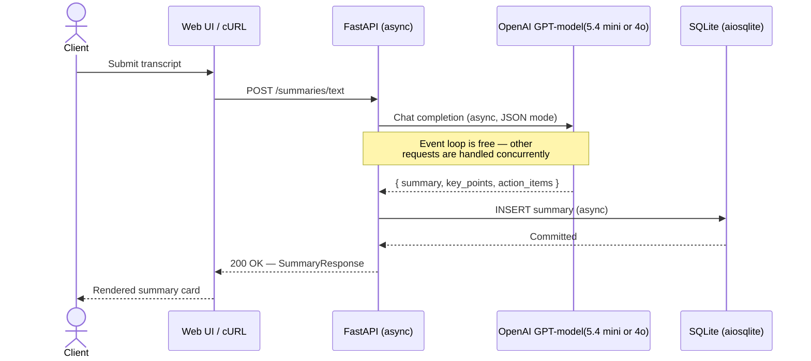

# MedTranscript AI - Transcript Summarizer API

A fully async FastAPI service that summarizes medical doctor-patient phone call transcripts into structured JSON (summary, key points, action items) using OpenAI. Includes a polished web UI, benchmark tooling, and a transcript generator powered by real medical data.

---

## Repository Structure

```text
api-transcript/
├── app/                          # Core FastAPI application
│   ├── main.py                   # App init, lifespan, CORS, static serving
│   ├── api/
│   │   └── routes.py             # All REST endpoints
│   ├── db/
│   │   ├── database.py           # Async SQLAlchemy engine + session
│   │   └── models.py             # Summary ORM model
│   ├── schemas/
│   │   └── schemas.py            # Pydantic request/response schemas
│   └── services/
│       └── ai_service.py         # OpenAI / Azure OpenAI client (lazy init)
├── static/
│   └── index.html                # Single-page demo web UI
├── transcripts/                  # Generated sample transcripts (.txt)
├── benchmark.py                  # Async concurrency benchmark
├── simulate.py                   # CSV-to-transcript + API simulation
├── generate_transcripts.py       # AI-powered realistic transcript generator
├── .env.example                  # Environment variables template
├── requirements.txt              # Python dependencies
└── README.md
```

---

## Architecture

The entire stack is **async end-to-end** — FastAPI routes, SQLAlchemy engine, and OpenAI client all use `async/await`. This means the server never blocks while waiting for AI responses, allowing it to handle many concurrent requests on a single worker.



---

## API Endpoints

All endpoints are prefixed with `/summaries`.

| Method | Endpoint | Description |
|--------|----------|-------------|
| `GET` | `/summaries/` | List all summaries (paginated: `?skip=0&limit=20`) |
| `POST` | `/summaries/text` | Generate summary from JSON text body |
| `POST` | `/summaries/file` | Generate summary from uploaded `.txt` file |
| `GET` | `/summaries/{id}` | Retrieve a specific summary |
| `PATCH` | `/summaries/{id}` | Partially update summary fields |
| `GET` | `/samples` | List available sample transcripts |
| `GET` | `/` | Serve the web UI |

### Request / Response Examples

**POST /summaries/text**

Request:
```json
{
  "text": "Doctor: Good morning! How are you feeling today?\nPatient: Not too great, honestly..."
}
```

Response:
```json
{
  "id": 1,
  "original_text": "Doctor: Good morning! How are you feeling today?\nPatient: Not too great...",
  "summary": "The call involved a follow-up consultation between Dr. Lee and Mrs. Thompson regarding her recent colonoscopy results. Two small polyps were found and removed from the sigmoid colon. The doctor also noted diverticulosis and advised dietary changes.",
  "key_points": [
    "Two polyps removed from sigmoid colon via electrocautery, no bleeding",
    "No recurrence of polyp in the cecum from two years ago",
    "Diverticulosis found in sigmoid colon — benign but requires monitoring",
    "Two submucosal lipomas found — benign, no removal needed",
    "Patient currently on Metformin 500mg twice daily, blood sugar 120-140",
    "Blood pressure needs regular monitoring, threshold 140/90"
  ],
  "action_items": [
    "Increase fiber intake to at least 25g daily",
    "Monitor blood pressure every morning — call if above 140/90",
    "Schedule fasting lab work (blood sugar + cholesterol) before next visit",
    "Follow-up appointment in two weeks",
    "Limit processed foods and red meat",
    "Track any abdominal pain or bowel habit changes"
  ],
  "created_at": "2026-04-03T10:15:30.123456"
}
```

**PATCH /summaries/1** (partial update)

Request:
```json
{
  "action_items": ["Follow up in 2 weeks", "Pick up new prescription"]
}
```

Only the provided fields are updated — other fields remain unchanged.

---

## Web UI

A polished single-page dark-themed dashboard served at `http://localhost:8000`.

### Pages

| Page | Description |
|------|-------------|
| **Dashboard** | Stats overview (total summaries, avg key points, avg action items) + recent summaries |
| **Generate Summary** | 3 input modes: text input, file upload (drag & drop), or pick from sample library |
| **History** | Paginated list of all summaries with search, edit, and view transcript |
| **Batch Process** | Select multiple samples, process concurrently with live progress bar |
| **Sample Library** | Browse all generated transcripts with preview and one-click summarize |

### UI Features

- Dark theme with indigo/purple accent gradient
- Summary cards with color-coded key points (blue) and action items (green)
- Edit modal — inline edit summary, key points, and action items (PATCH)
- View original transcript with Doctor/Patient syntax highlighting
- Toast notifications (success, error, info)
- Loading spinners and skeleton states
- API connection status indicator
- Drag & drop `.txt` file upload
- Responsive layout

---

## Benchmark Results

Tested with `benchmark.py` and `simulate.py` using real medical transcripts (~700-800 words each) against OpenAI `gpt-4o-mini`.

### Concurrency Benchmark (`benchmark.py`)

| Phase | Requests | Wall Time | Sequential Estimate | Speedup |
|-------|----------|-----------|---------------------|---------|
| 3 concurrent POST | 3 | **6.75s** | ~19.1s | **2.8x** |
| 5 concurrent POST | 5 | **8.21s** | ~28.6s | **3.5x** |
| 3 concurrent PATCH | 3 | **0.019s** | — | near-instant |
| 3 concurrent GET | 3 | **0.005s** | — | near-instant |

### End-to-End Simulation (`generate_transcripts.py --test`)

| Metric | Value |
|--------|-------|
| Transcripts generated | 10/10 |
| Summaries created | 10/10 (100% success) |
| Concurrent summary wall time | **8.27s** for 10 requests |
| Avg key points extracted | 7.4 per summary |
| Avg action items extracted | 3.5 per summary |
| Avg transcript length | ~728 words (~4-5 min call) |

### Cloud Benchmark (Railway Deployment)

Tested against the live Railway deployment with `gpt-5.4-mini`:

| Phase | Local (localhost) | Railway (cloud) |
|-------|------------------|-----------------|
| **5x POST** wall time | 8.21s | **3.80s** |
| **5x POST** avg latency | 5.72s | **3.66s** |
| **5x PATCH** wall time | 0.026s | 0.41s |
| **5x GET** wall time | 0.005s | 0.21s |
| POST speedup vs sequential | 3.5x | **4.8x** |

Cloud POST is faster (better network path to OpenAI). DB ops have ~200ms network latency overhead, expected for a remote server.

### Key Takeaway

The async architecture allows **N concurrent AI requests to complete in roughly the time of 1 sequential request**. Database operations (GET, PATCH) are sub-millisecond locally. The bottleneck is purely the AI inference latency (~3-8s per call), which is fully parallelized.

### Scalability Limits & What Would Be Needed for 100+ Concurrent Requests

The current setup handles **10-20 concurrent requests** reliably. Pushing to 100+ concurrent POST requests would hit several bottlenecks:

| Component | Current Limit | What Breaks at 100 |
|-----------|--------------|---------------------|
| **FastAPI (async)** | Thousands of connections | No issue — event loop handles I/O-bound concurrency well |
| **OpenAI API** | ~20-30 concurrent | Rate limits (TPM/RPM) return 429 Too Many Requests |
| **SQLite (aiosqlite)** | ~20-30 concurrent writes | Single-file DB, write lock contention causes errors |
| **Railway (1 worker)** | ~30-50 connections | Memory pressure, potential OOM or timeouts |

**To reliably handle 100+ concurrent requests, the following changes would be needed:**

1. **Rate limit handling** — Add retry with exponential backoff on 429 responses in `ai_service.py`
2. **Request batching** — Process in waves of 10-20 instead of firing all 100 at once
3. **Swap SQLite for PostgreSQL** — Handles concurrent writes properly (Railway offers free Postgres)
4. **Multiple workers** — Run `uvicorn --workers 4` or horizontally scale on Railway
5. **Request queue** — Add a task queue (e.g., Celery/Redis) to decouple request intake from AI processing

---

## Setup

### 1. Create Virtual Environment

```bash
python3 -m venv venv
source venv/bin/activate
pip install -r requirements.txt
pip install httpx  # for benchmark/simulate scripts
```

### 2. Configure Environment

Copy `.env.example` to `.env` and set your credentials:

```bash
cp .env.example .env
```

**For OpenAI (standard):**
```env
OPENAI_PROVIDER=openai
OPENAI_API_KEY=sk-your-key-here
OPENAI_MODEL=gpt-4o-mini
```

**For Azure OpenAI:**
```env
OPENAI_PROVIDER=azure
AZURE_OPENAI_API_KEY=your-azure-key
AZURE_OPENAI_ENDPOINT=https://your-resource.openai.azure.com/
AZURE_OPENAI_VERSION=2024-02-15-preview
OPENAI_MODEL=gpt-4o-mini
```

### 3. Start the Server

```bash
# Development
uvicorn app.main:app --reload

# Production (multiple workers)
uvicorn app.main:app --workers 4 --host 0.0.0.0 --port 8000
```

Then open:
- **Web UI**: http://localhost:8000
- **Swagger docs**: http://localhost:8000/docs
- **ReDoc**: http://localhost:8000/redoc

---

## Tools & Scripts

### Generate Realistic Transcripts

Uses OpenAI to transform raw medical notes from `mtsamples.csv` (4,999 cases) into realistic 5-minute phone call transcripts with natural dialogue, filler words, emotions, and rich summarizable content.

```bash
# Generate 10 transcripts, save to transcripts/
python generate_transcripts.py --count 10

# Generate + send to summary API for end-to-end test
python generate_transcripts.py --count 10 --test

# Custom output directory
python generate_transcripts.py --count 20 --output my_transcripts
```

### Benchmark Concurrency

Tests raw API throughput with concurrent POST, PATCH, and GET requests.

```bash
# Default: 5 concurrent users
python benchmark.py

# Stress test with 20 concurrent users
python benchmark.py --users 20
```

### Simulate from CSV

Transforms CSV medical notes into dialogues and fires them at the API.

```bash
# 5 concurrent requests + PATCH test
python simulate.py --count 5 --concurrent --patch

# Save transformed transcripts only (no API)
python simulate.py --count 10 --save transcripts --no-api
```

---

## Tech Stack

| Component | Technology |
|-----------|-----------|
| Framework | FastAPI (async) |
| Database | SQLite + aiosqlite + SQLAlchemy (async) |
| AI | OpenAI GPT-4o-mini (JSON mode) |
| Validation | Pydantic v2 |
| Frontend | Vanilla HTML/CSS/JS (single-page) |
| HTTP Client | httpx (async, for benchmarks) |
| Data Source | mtsamples.csv (4,999 medical transcription samples) |
